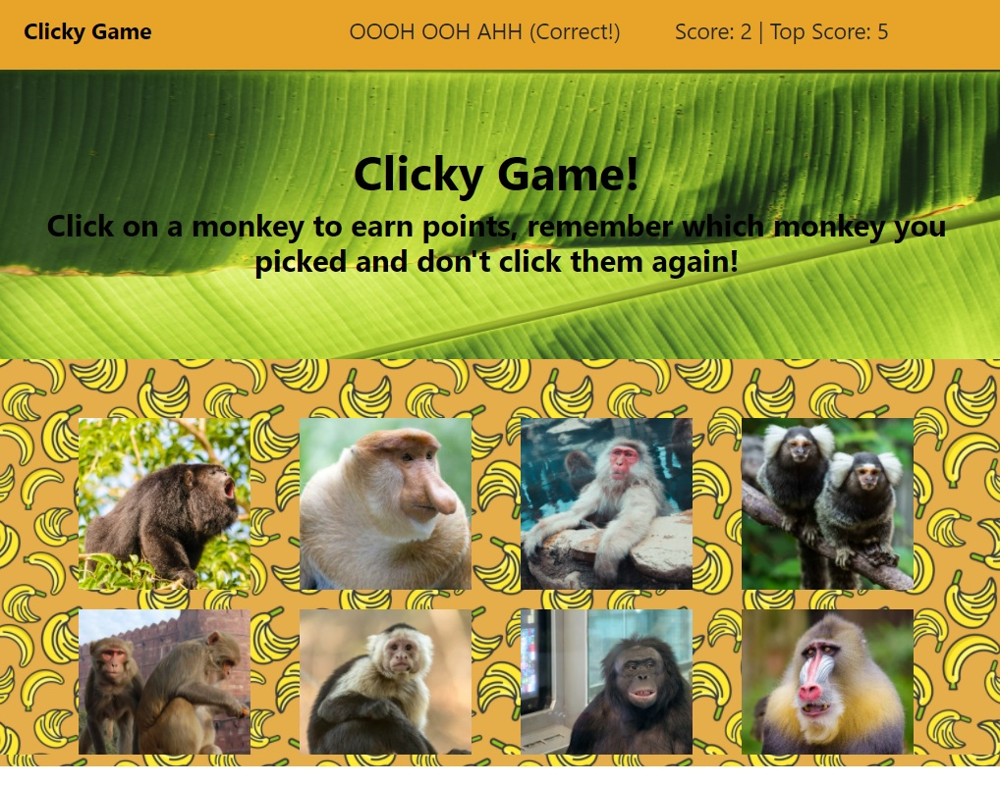
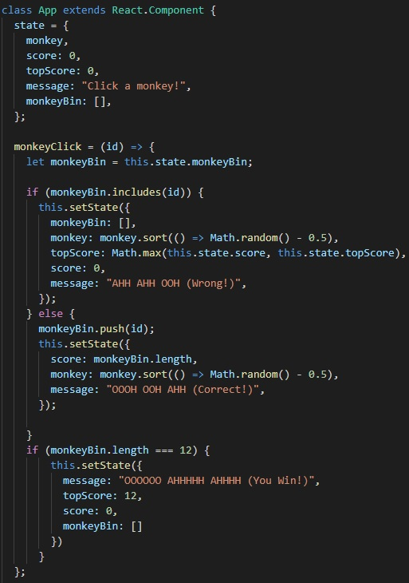
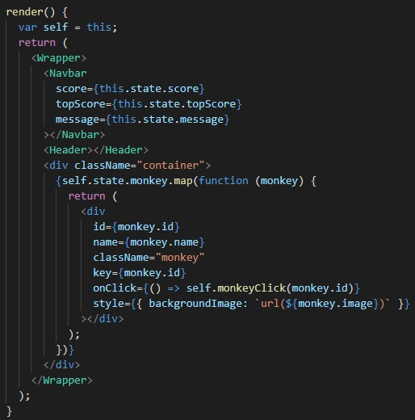
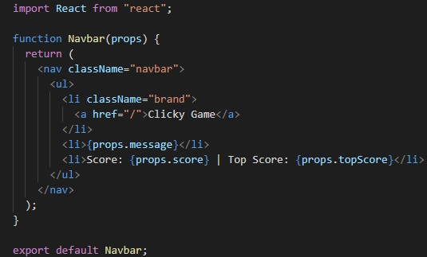

Clicky-Game
====

# Description
Clicky-Game is a React application in the form of a picture memory game that shuffles around images of monkies and counts scores for unique clicks. Every click shuffles the board, incorrect clicks will reset your score, and correct clicks will increment your score up to a total of 12.



----

# What's in this Barrel of Monkies??
In this app you'll notice a `src` folder. This is where the action happens. In the `components` folder within, each component is built out using `JSX` which looks very similar to `HTML` but it's not. Certain conventions don't apply, camelcase is necessary for attributes of html elements for example.

Once the components are prepared, they are compiled within the `App.js` file. Then, what's been compiled is exported to the `index.js` file which renders it all to the `root` of the document.

You'll see in the `App.js` file there is not only rendering of components, but here components can be manipulated and changed. `States` can be created that change certain elements on the page. These changes overwrite the original contents of these elements, so careful attention should be paid to how one defines a state.



Here are the examples of the states set in this app.

Here is our initial state:
```
state = {
    monkey,
    score: 0,
    topScore: 0,
    message: "Click a monkey!",
    monkeyBin: [],
  };
```
Upon page load this will leave our Scores at 0 and the message in the navbar as depicted. Once the user starts clicking other things happen however.

```
if (monkeyBin.includes(id)) {
      this.setState({
        monkeyBin: [],
        monkey: monkey.sort(() => Math.random() - 0.5),
        topScore: Math.max(this.state.score, this.state.topScore),
        score: 0,
        message: "AHH AHH OOH (Wrong!)",
      });
    } else {
      monkeyBin.push(id);
      this.setState({
        score: monkeyBin.length,
        monkey: monkey.sort(() => Math.random() - 0.5),
        message: "OOOH OOH AHH (Correct!)",
      });
```
In these conditional statements new states are being created using `this.setState`.
Notice in the else statement that if the choice is valid it pushes the monkey into our array `monkeyBin` that was initially an empty array and the `score` matches the length of the array. A `message` is also rendered and the original array of monekies is `randomized` so that it shuffles them on screen. 

However, if the user chooses wrong, the array is emptied, the score corrects to 0, a message indicating a wrong choice is displayed, the `top score` is calculated and once again the monkies shuffle.

```
if (monkeyBin.length === 12) {
        this.setState({
          message: "OOOOOO AHHHHH AHHHH (You Win!)",
          topScore: 12,
          score: 0,
          monkeyBin: []
        })
      }
```
Finally, if the user reaches 12 correct choices a message of `victory` is displayed, the highest score of 12 is achieved and the game resets, emptiying the array and returning the score to 0.

----

# How do you get the States to Work?
After you have defined your various states its time to render the components.


Notice in the `Navbar` component we are specifying that `score` `topScore` and `message` are equal to `{this.state.xxxx}` this enables us to target elements in the respective component file using `props`.


Inside of the `navbar.js` file within the `commponents` folder we pass the `Navbar` function the parameter of "props", then the elements we have targeted for our states will recieve `{props.xxxx}` in it's place.

One more thing to note from the larger image above in regards to rendering our components: between the `Header` and end of the `Wrapper` there is in-line coding for the monkey images that does the same work as importing a file from the component folder as above. All data regarding monkies was placed in the `monkey.json` file and is imported here to the `App.js` file to be mapped and rendered. The one strange thing here is the definition of `var self= this` at the very top of the `render()` function which appears again in the `onClick` portion of the monkey div. This is necessary due to scoping concerns, otherwise React won't be able to accept `this.monkeyClick` in the arrow function. This `onClick` portion lets the div know there is some sort of action that will take place involving a click that will be grabbing the `id` of the monkey. Then we cycle back to the top of the document where our `monkeyClick` function id defined after the initial state is set.

----

# Improvements

Could use more monkies.

----


# Project Link
[Deployed Link](https://spenrad.github.io/Clicky-Game/) <br>
[Project Repository](https://github.com/spenrad/Clicky-Game) <br>

----

# Monkey Business
Spencer Christy<br>
[GitHub](https://github.com/spenrad)<br>
[LinkedIn](https://www.linkedin.com/in/spencer-christy-543b84b3/)<br>

