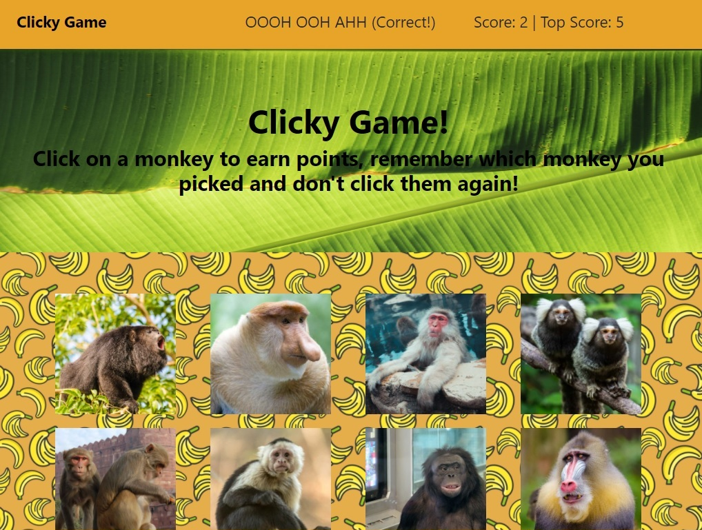

Clicky-Game
====

# Description
Clicky-Game is a React application in the form of a picture memory game that shuffles around images of monkies and counts scores for unique clicks. Every click shuffles the board, incorrect clicks will reset your score, and correct clicks will increment your score up to a total of 12.

----

# What's in this Barrel of Monkies??
In this app you'll notice a `src` folder. This is where the action happens. In the `components` folder within, each component is built out using `JSX` which looks very similar to `HTML` but it's not. Certain conventions don't apply, camelcase is necessary for attributes of html elements for example.

Once the components are prepared, they are compiled within the `App.js` file. Then, what's been compiled is exported to the `index.js` file which renders it all to the `root` of the document.

You'll see in the `App.js` file there is not only rendering of components, but here components can be manipulated and changed. `States` can be created that change certain elements on the page. These changes overwrite the original contents of these elements, so careful attention should be paid to how one defines a state.

----

# Project Link
[Deployed Link](https://spenrad.github.io/Clicky-Game/)  
[Project Repository](https://github.com/spenrad/Clicky-Game)  

----

# Monkey Business
Spencer Christy 
[GitHub](https://github.com/spenrad) 
[LinkedIn](https://www.linkedin.com/in/spencer-christy-543b84b3/) 

